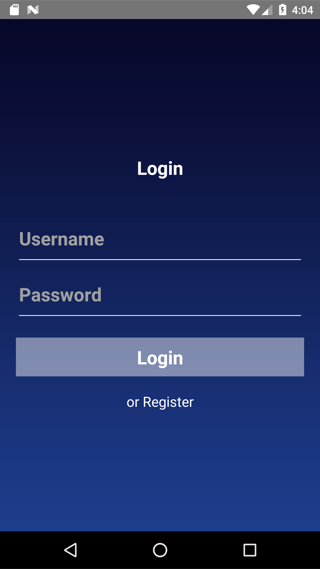
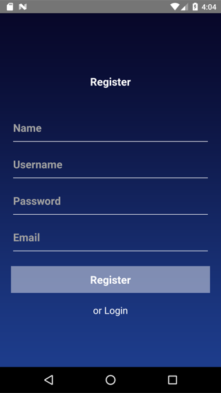
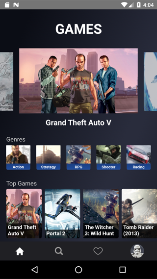
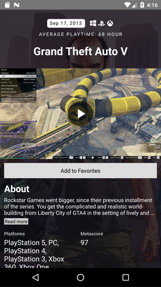
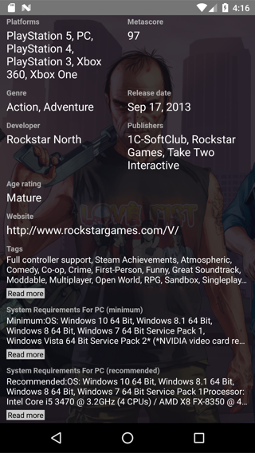
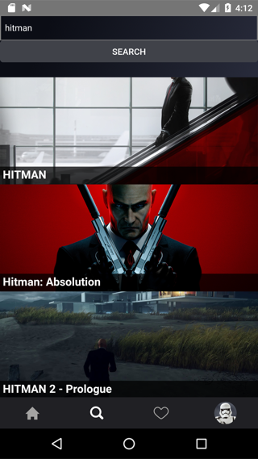
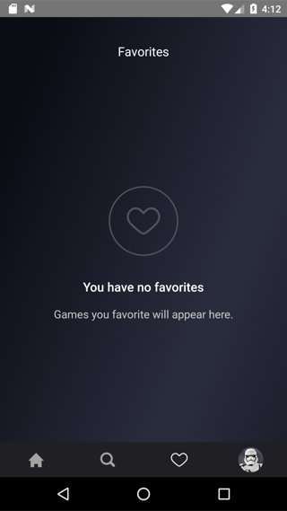
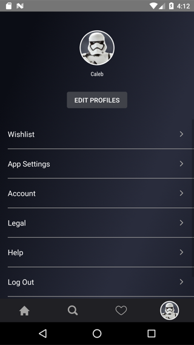

# react-native-games

[](https://github.com/iethem/react-native-boilerplate)

<p align="center">
  
  
  
  
  
  
  
  
</p>

---

In this project, I used some styling and components used on the [calebnance/expo-disneyplus](https://github.com/calebnance/expo-disneyplus) project. I removed everything related to expo. Also, I implemented login/registration features to demonstrate redux-saga and navigation stuff. Instead of movies, I used games. I am still working on some features like adding accounts, improving API usage, removing unnecessary files, useful theming, etc.


Clone this repo using the following command:
```command
git clone https://github.com/iethem/react-native-games.git
```
Move to the appropriate directory: 
```command
cd react-native-games
```
Run `npm install` in order to install dependencies.<br />
```command
npm i
```
For <b>IOS</b>:
```command
npx pod-install
npm run ios
```   
For <b>Android</b>:
```command
npm run android
```
Start the server:
```command
npm start
```

## TODO

- [ ] Add or remove games on favorites using Async Storage (because I used Async Storage to hold user data)
- [ ] Change static text messages to i18n messages
- [ ] Remember me
- [ ] Add or remove accounts
- [ ] Remove unused files (like some redux-saga stuff)
- [ ] Fix account screen (some menus are not working properly)
## Notes

If you like this project please check the [react-native-boilerplate](https://github.com/iethem/react-native-boilerplate) project I used for this.

__Login/Registration:__ Uses Async Storage to simulate login/registration stuff. See `LoginScreen/RegisterScreen's saga.js` and `utils/userStorage.js`.

__Games:__ The application fetches games using [rawg.io API](https://rawg.io/apidocs).

__i18n:__ The project has i18n normally but static texts were not converted as i18n messages.

> Use `npm run generate` to create components/containers/languages.

## Contributions

Contributions of any kind welcome!

## Notice

I intend no copyright infringement. Please let me know if I have added something of yours & you'd like it removed.
